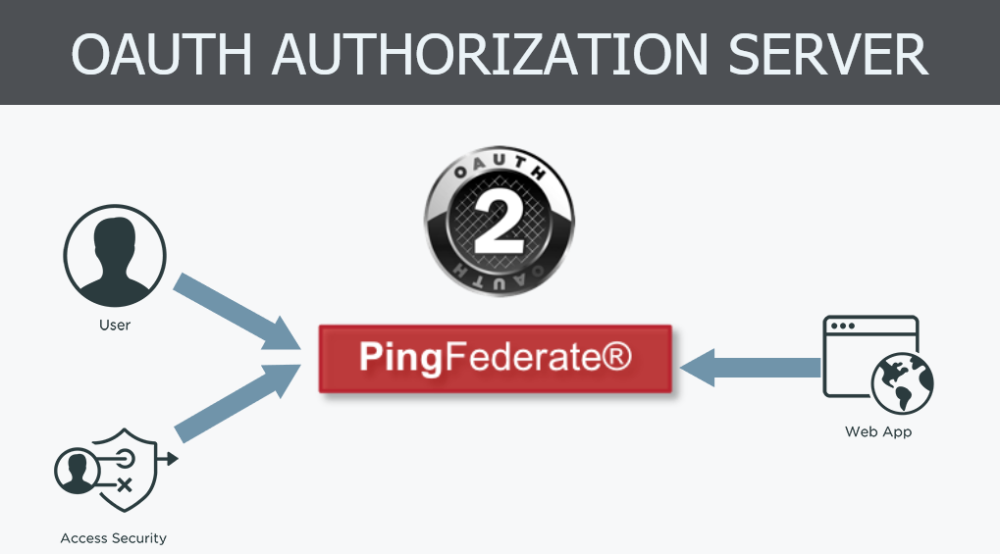

# 2. PF 10.2 Product Overview

## PingFederate Overview

### Single Sign-On Ping

_**“**PingFederate is a robust full featured stand alone identity bridge & Federation hub - Ping Fed Single sign-on capability grants your employees, customers and partners seamless access to all their mobile, cloud and enterprise applications. Using industry standing protocols such as SAML / OAUTH 2.0 / OpenID connect \(and SCIM\), PingFed supports both inbound and outbound identity federation. By providing a highly configurable solution, PingFed allows you to connect to any application, even legacy ones.”_

### Authentication Authority

_“PingFederate can also act as an authentication authority providing adaptive and highly configurable authentication policies. Multi Factor authentication is readily supported through integration with PingID or other third party MFA providers. PingFed can also be integrated with almost any directory service providing you the ability to aggregate user attributes from multiple sources.“_

### Workspace, Customer, and Partner Identities

_“Ping federates lightweight and scalable architecture allows you to provide registration, profile management and password reset services to your users you can also take advantage of social login paradigms to streamline your business processes as a SAAS provider you can let partner's manager their own user identities reducing your overall workload.“_

## PingFederate Features - Server Roles

### Identity Provider \(IdP\)

_“When discussing browser single sign-on, the identity provider \(idp\) is responsible for authenticating users, collecting the required attributes, and sending that information to the service provider partner in the form of an assertion. With the identity provider role enabled, PingFederate can be used to authenticate users and connect them seamlessly to not only your internal applications, but also to your externally-hosted cloud or SAAS applications as well. By standard protocols such a SAML, ws-federation and ws-trust, you can create connection profiles for any number of applications or services. Integration with your existing authentication and identity infrastructure allows PingFederate to provide secure access to any application anytime from anywhere.”_

### Service Provider \(SP\)

_“On the application side, we have the service provider the service provider \(SP\) is responsible for receiving incoming assertions, passing out the user attributes, and then using those attributes to facilitate access to an application or service. As a SAAS provider PingFederate can be leveraged to handle this interaction seamlessly, just like the identity provider use case PingFederate can easily be integrated with your SAAS application and any backend identity infrastructure you have in place. In addition to the SAML, ws-federation and ws-trust protocols the PingFederate SP roll also supports open ID connect. With open ID connect, you can allow users to log into your application using their social media profile by leveraging one of pings pre-built cloud identity connectors.”_

### Account Provisioning

_“PingFederate also supports the system for cross-domain identity management. The SCIM protocol for inbound and outbound provisioning. As an identity provider PingFederate can use the SCIM protocol to preform outbound provisioning of user accounts of service provider sites that support SCIM. As a service provider you can use SCIM to allow your identity provider partner's to manage their own user accounts reducing the overall management overhead and TCO for your SAAS application”_

### OAuth 2.0

_“PingFederate fully supports the OAUTH 2.0 protocol. Acting as an OAUTH authorisation server, PingFederate can allow a resource owner to Grant authorisation to a client requesting access to a resource protected by a resource server._  
_The PingFederate authorisation server can be used in a number of scenarios, such as_

* A web application wants access to a protected resource associated with a user and needs the users consent.
* A native application client on a mobile device or tablet wants to connect to a users online account and needs the users consent.
* An Enterprise application client wants to access a protected resource hosted by a business partner, customer, or SAAS provider.

_The PingFederate OAUTH authorisation server can be configured independently or in conjunction with browser based single sign-on, for either an identity provider or service provider deployment.“_

### OpenID Connect

_“OpenID Connect is a simple extensible identity layer, built on top of the OAUTH 2.0 protocol. With OpenID Connect, your PingFederate not only provide authorisation services for your OAUTH clients, but also provide access to user profile information. For your clients, OpenID Connect provides a secure verifiable answer to the question “What is the identity of the person using the browser or native app that is connected to me”_

### Relying Party

_“In addition to acting as an OpenID Connect provider PingFederate can also leverage OpenID Connect to complete browser single sign-on requests. In this case PingFederate will act like an OAUTH Client, specifically a relying party. PingFederate retrieves identity information from a separate OpenID Connect provider and passes those attributes to one or more Target applications. This configuration allows administrator take advantage of their existing last-mile integration and expand the Horizon of their applications to additional partners.”_

## Deployment Options

### Proxy deployment

_“PingFederate can be deployed in a standalone fashion, either behind a firewall or behind a web proxy._  
_In a stand alone deployment, PingFederate is installed on a server in your company internet DMZ, and users access the server directly._  
_You can also Deploy PingFederate behind a proxy server to increase access controls and overall security, in this deployment PingFedereated is accessed through the proxy server, and the proxy server intern communicate PingFederate instance.“_

### Clustered Deployment

_“PingFederate can also be deployed as a cluster, In a cluster deployment, you can have multiple runtime engines that all share the same configuration. The runtime engines are each fully capable of handling any Single Sign-on, OAUTH, or OpenID Connect traffic. User state information is shared between the nodes in the cluster, so any node can process any transaction at any time. The cluster is administered through a single administrative console node”_

### Adaptive Clustering

_“Starting with PingFederate 9.0 ping identity has introduced adaptive clustering. Adaptive clustering allows for dynamic discovery of cluster nodes, which simultaneously increases cluster elasticity while decreasing configuration complexity for large cluster deployments. User states are automatically hashed and stored in redundant replica sets, distributed throughout the cluster. This ensures that user state information will not be lost if any single node goes offline”_

### Dynamic Discovery

_“Dynamic Discovery is supported with Amazon elastic compute cloud \(EC2\), Amazon simple storage service \(S3\), and openstack Swift. Dynamic discovery allows nodes to dynamically join or leave the cluster in both public and private cloud storage environments. implementing adaptive clustering requires only a one-time setup. After setup cluster nodes can be brought on line or taken off line in an on-demand fashion turn the flexibility allows your cluster to scale up or down depending on current traffic demands.”_

## Integration with other Ping products

### PingFederate Ecosystem

_"PingFederate can be integrated with a number of other ping identity products to provide a complete identity and token management solution._

* _Integration with PingID provides multi factor authentication for your users and applications._
* _PingOne is ping identity’s multi tenant identity as a service \(IAAS\) solution, PingOne can be used together with PingFederate to provide a powerful solution combining the benefits of an on-premise deployment with the flexibility of a cloud solution._
* _PingAccess is an identity enabled access management product that protects web applications and APIs by applying security policies to client requests. With full support for OAUTH and OpenID Connect, PingFederate connectors an authorisation source and token provider for your ping access server._
* _Finally PingFederate makes use of external directory services to look up user attributes for browsers single sign-on and to generate access tokens. PingDirectory and PingOne directory provides a flexible robust and high performance for Enterprises of any size“_

