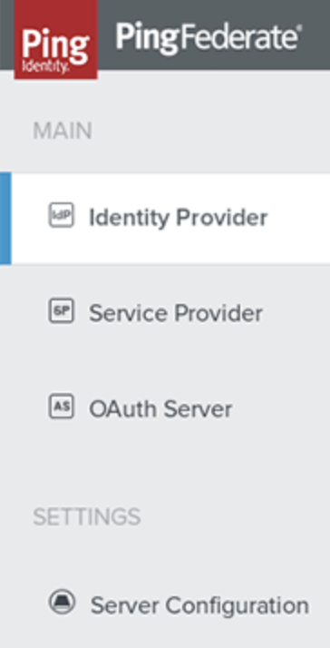

# Course Notes - PingFederate 2

## Administrative Console Introduction

* Login to the admin console. `https://pf.int.course-ping.com:9999:/pingfederate/app`
* On the left of the console, each enabled server role should be displayed. Server Configuration should be shown below.

### Identity Provider

#### Application Integration


Notes: "Used to create adapters which will connect to your authentication and user store backend"


* Adapters: 
* Default URL:
* Application Endpoints:

#### Authentication Policies


Notes: "manage your authentication policies, selectors and contracts for the IdP role"


* Policies:
* Selectors:
* Policy Contracts:
* Sessions:

#### Local Identity


Notes: "Allow users to authenticate against a third party Identity Provider"


* Identity Profiles: 

#### SP Connections


Notes: Shows your SP \(Service Provider\) Connections.


### Service Provider

#### IDP-TO-SP Bridging

Note: "Provided for special use cases when PingFed is acting as both an IdP and an SP... user attributes from an IdP adapter are used to create an authentication session via an SP adapter on the same PingFed Server"

* Adapter-to-Adapter Mappings: 

#### Federation Info

* Protocol Endpoints: list of all of the protocol endpoints for this PingFeds SP Role

#### SP Affiliations

"Manage links to affiliated service partners as defined by the SAML 2.0 Spec."

### OAuth Server

#### Authorization Server


Notes: 


*  Authorization Server Settings
* Scope Management
* Client Settings
* Client Registration Policies

#### Grant Mapping


Notes: 


* IdP Adapter Mapping
* Authenication Policy Contract Mapping
* Resource owner credentials Mapping


ROPC \(Resource Owner Password Credentials\) Grant Type:


#### Clients

?

### Server Configuration

#### Token Mapping


Notes: Controls now attribute are mapped to access tokens. Also configure OpenID Connect polices and mappings.


* Access Token Management: 

#### Authorization Server Info


Notes: 


* OAuth Endpoints

  

